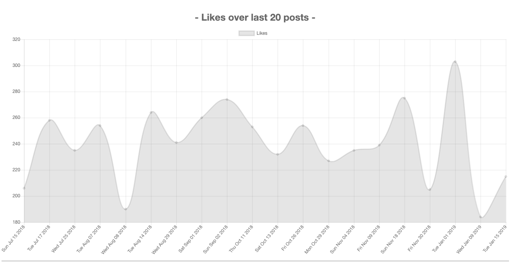
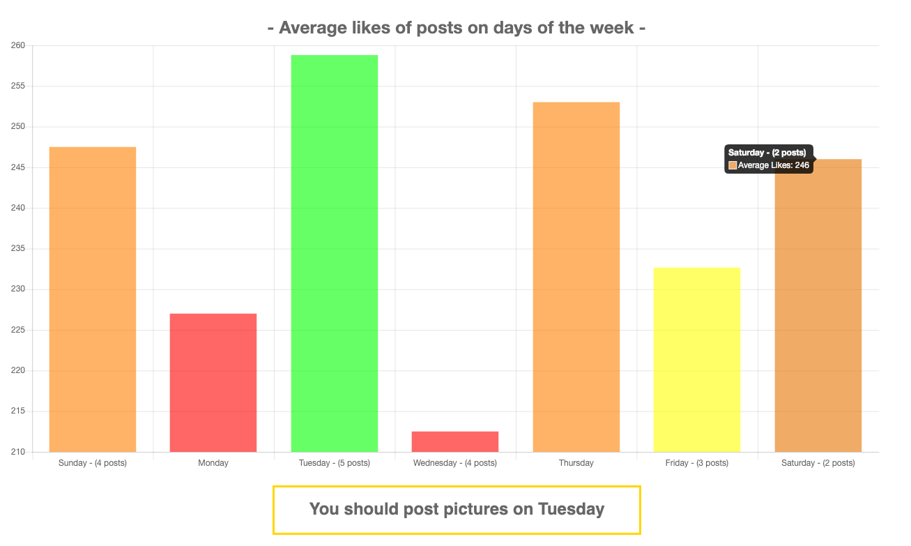
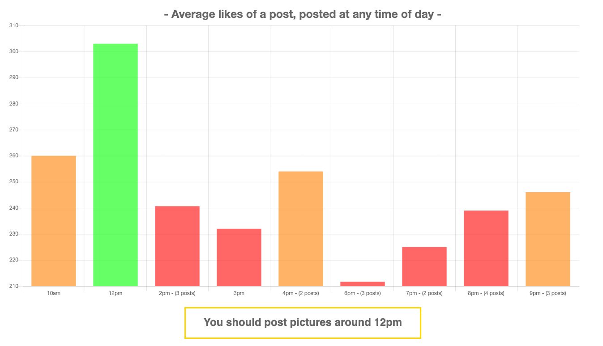

<a href="https://timelike.herokuapp.com/">Deployed Link</a> 

<h1>What is TimeLike?</h1>
          

TimeLike is an app I created that tries to solve the 'active instagramers' crisis.  The active instagramers crisis can be described as follows: Due to the rapid growth of social media, everyone and they mother is using instagram, because of this, people are recieveing lots of followers all the time, and who can keep up?! There are so many confounding variables as to why any said person may not recieve even half of the likes that they should get (within reason). Some of these variables include:

<ul>
	<li>People busy with work durring the day, and/or other activities.</li>
	<li>Inactive accounts. (dont see your post)</li>
	<li>Some of your followers might have a lot of followers and cant keep up.</li>
	<li>The list goes on</li>
</ul>            

          
This is solved by analyzing data from instagram to find at what time of the day, to post, based on how many likes you recieved at any said time.
Unfortunately, without advanced buisness tools, I cannot account for how many followers a person had at any time durring their instagram account's growth,so there is a slight skew; Instagrams api only allows peeople without buisness tools to pull the 20 most recent post - any data analyzed is recent.

<h2>Screenshots:</h2>

      
